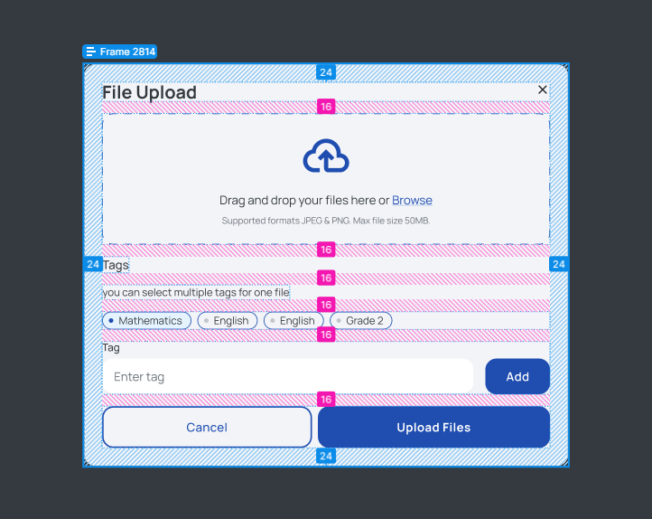
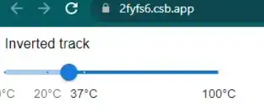
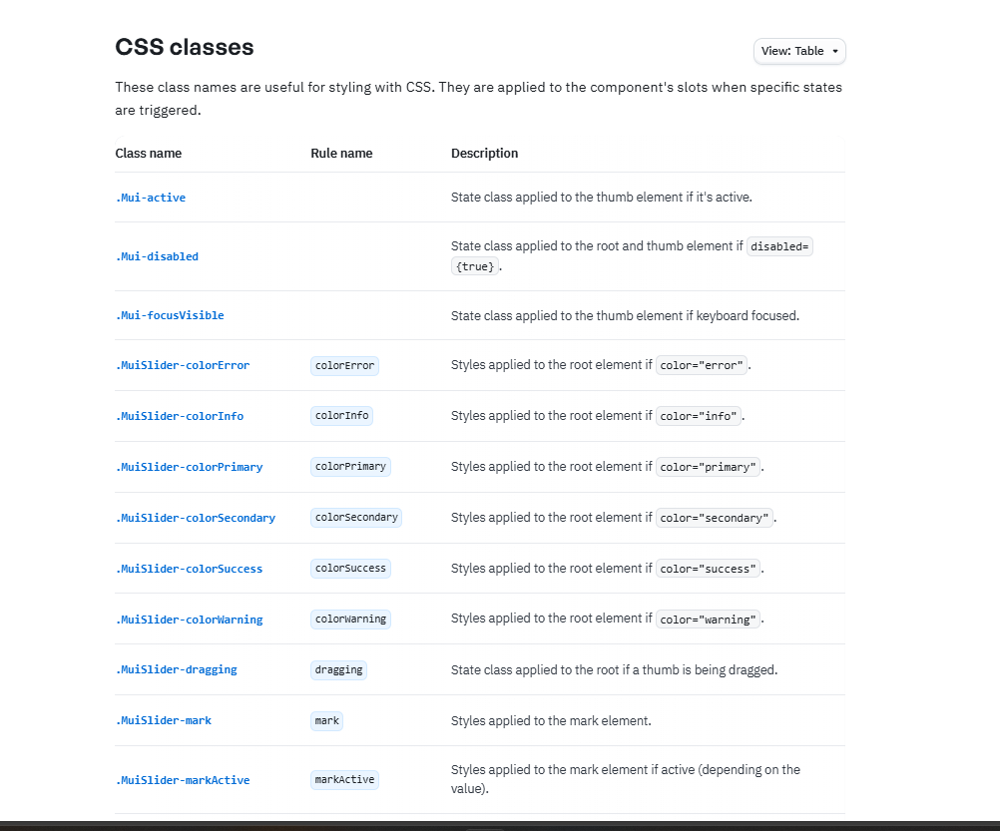

# Let's create this modal

### Here is the spacing between components

When styling with mui components, use the SX Prop. Then delete the sx props and try to purely style based on css stylesheet injections. You may use regular divs or MUI Grids and Stacks for your modal's layout and sizing.

If you have time, you may incorporate the correct typography font as well. Otherwise, simply try to mimic the fontWeight and size.

# Final task:

- Add a Slider component from MUI to the modal and style it to look like this using SX Prop:
  

CSS Class documentation:

https://mui.com/material-ui/api/slider/

These are the mui components of interest within the modal:

- Chip
- Button
- Typography
- TextField
- Slider (final exercise)
